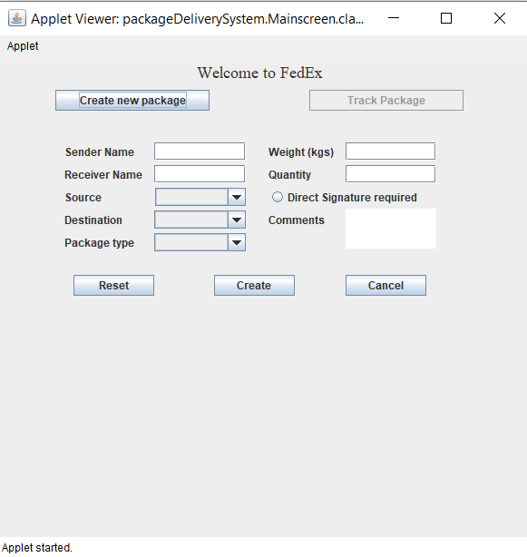
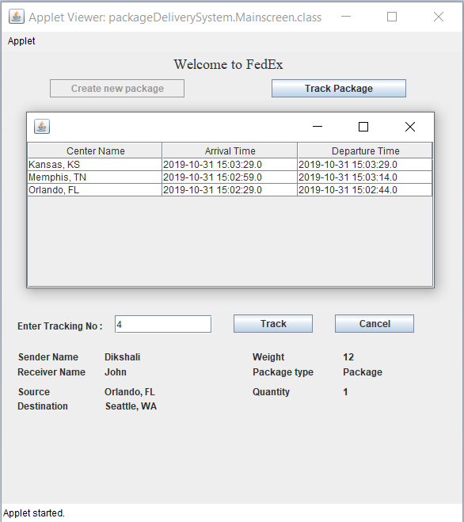

# Package-Tracking-System

An application to display tracking information for the package delivery system of FedEx. The application accepts new packets with their properties. Every active packet creates its own thread as it travels from source to destination in the system. The user will also be able to query with an input tracking number and print the tracking details of the package.

## **Technologies:**
* Java
* Database: MySQL
* Java Applet

## Screenshots

Create Package Screen             |Track Package Screen            |
:-------------------------:|:-------------------------:
 |   

## Getting Started

These instructions will get you a copy of the project up and running on your local machine for development and testing purposes.

### Prerequisites
* Eclipse IDE. [Download here](https://www.eclipse.org/eclipseide/)
* MySQL [Download](https://www.mysql.com/downloads/)

### Installing

1. Clone the repository.
2. Open the project in Eclipse IDE.
3. Run the DB script in MySQL server.
4. Run the project using java applet.
